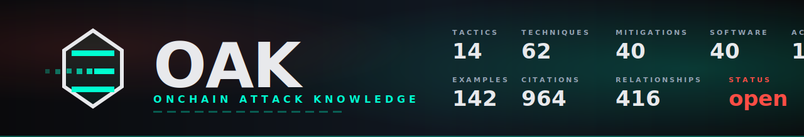

<p align="center">
  
</p>

# OAK — OnChain Attack Knowledge

> *A common language for on-chain adversary behavior.*

OAK is an open, vendor-neutral knowledge base of adversary **Tactics** and **Techniques** observed against on-chain assets — tokens, liquidity, custody, and the wallets and protocols that interact with them. The threat surface is fundamentally different from traditional IT infosec: public-ledger finality, anonymous adversaries, money-and-laundering as the primary objective, smart-contract code as the attack surface, no patchable endpoints. OAK exists because crypto needs vocabulary built for crypto's threat model, not borrowed from elsewhere.

This is **v0.1 — a draft for community comment.** Coverage spans 14 Tactics and 62 Techniques, biased toward techniques with at least one production reference implementation in [`mg-detectors-rs`](https://github.com/MeatGrinder-MG/mg-detectors-rs). Gaps are documented honestly, not papered over.

## Why OAK exists

On-chain attackers reuse a small, finite set of Tactics — but the security, research, and on-chain-monitoring communities lack a shared vocabulary to describe them. Investigators, vendors, and risk teams each use their own terminology; coverage claims are not comparable across products; and academic findings rarely transfer cleanly to operational defense.

OAK provides a stable identifier system (`OAK-Tn` for Tactics, `OAK-Tn.NNN` for Techniques) so that:

- Investigators can attribute findings unambiguously.
- Vendors can map their detectors to specific Techniques and publish honest coverage matrices.
- Risk teams can specify procurement requirements ("must cover OAK-T5.001 and OAK-T5.003").
- Researchers can cite a stable reference instead of redefining terms in every paper.

## Scope (v0.1)

- **14 Tactics** — operator-behaviour kill chain (T1-T8) + T9 Smart-Contract Exploit + T10 Bridge & Cross-Chain + T11 Custody and Signing Infrastructure + T12 NFT-Specific Patterns + T13 Account Abstraction Attacks + T14 Validator/Staking/Restaking Attacks.
- **62 Techniques** across the 14 Tactics, each with description, observed indicators, detection signals, real-world examples, reference implementations, mitigations, and citations.
- **Mitigations axis** in [`mitigations/`](./mitigations/) — 40 stable Mitigation identifiers (`OAK-MNN`) covering five classes: **detection** (M01-M07: source-bytecode verification, static-analysis pre-deployment, continuous bytecode-diff monitoring, funder-graph clustering, authority-graph enumeration, mempool/pre-block telemetry, cross-chain attribution-graph; M39 cross-protocol watcher-network); **architecture** (M09-M17: TWAP+multi-venue oracle, CEI+ReentrancyGuard, rate-limiting, replay binding, long challenge windows, multi-prover redundancy, threshold signing, pre-deployment audit, time-locked governance; M34 emergency-pause; M38 time-windowed withdrawal limits); **operational** (M18-M22, M37, M40: out-of-band destination verification, air-gap signing, vendor breach-notification SLA, anti-phishing training, rotate-on-disclosure, HSM/MPC custody, supply-chain package integrity); **venue** (M23-M28: audit-attestation registry, listing-time gate, wash-trade-rate metrics, Travel Rule, token-unlock calendar; M36 proof-of-reserves auditing); **wallet-UX** (M08, M29-M31: per-spender approval audit, full-address verification, per-dApp allowlist, EIP-712 permit display); plus **financial-recovery** (M32-M35: bug bounty programs, decentralized insurance, pause-by-default, whitehat-rescue coordination). Each Mitigation maps many-to-many to Techniques, so a vendor or risk team can specify procurement requirements as a coverage matrix rather than an inline list.
- **Software axis** in [`software/`](./software/) — 40 stable Software identifiers (`OAK-SNN`) for named tools, kits, and malware families used by Threat Actors. Drainer kits (S01-S07: Inferno, Angel, Pink, Monkey, Venom, Vanilla, Chick); DPRK macOS malware family (S08-S11, S19-S22, S29-S30: TraderTraitor, AppleJeus, Manuscrypt, 3CX trojan, KandyKorn, RustBucket, SwiftLoader, ObjCShellz, BeaverTail npm supply-chain, InvisibleFerret); DPRK persistence backdoors (S12 JADESNOW, S31 TigerRAT, S32 AppleSeed); ransomware binaries (S23 LockBit, S24 BlackCat/ALPHV, S25 Maui, S26 Conti, S27 Black Basta, S28 Royal/BlackSuit, S33 Akira, S34 RansomHub, S35 BlackByte, S36 Karakurt extortion-only kit); commodity loaders + post-exploitation (S15 AsyncRAT, S37 Cobalt Strike, S38 IcedID/Pikabot, S39 DanaBot, S40 Qakbot/Pinkslipbot); commodity infostealers (S13 RedLine, S14 Lumma); crypto-specific tooling (S16 Profanity, S17 jaredfromsubway.eth, S18 Pump.fun bundlers).
- **Data Sources axis** in [`data-sources/`](./data-sources/) — 12 stable Data Source identifiers (`OAK-DS-NN`) covering on-chain telemetry, mempool/pre-block telemetry, and off-chain CTI feeds. Lets defenders aggregate "what telemetry do I need to detect across the framework" as a separate axis.
- **Glossary** at [`GLOSSARY.md`](./GLOSSARY.md) — defender-perspective definitions of recurring vocabulary across OAK content.
- **Threat Actors axis** in [`actors/`](./actors/) — 18 stable Group identifiers (`OAK-Gnn`) with explicit attribution-strength language. **DPRK clusters** (G01 Lazarus / TraderTraitor; G04 IT-Worker Placement Scheme; G07 APT43 / Kimsuky; G08 BlueNoroff macOS-financial-targeting sub-cluster; G09 Andariel ransomware/ICS sub-cluster). **Russian-cybercrime ecosystem** (G03 Garantex / Grinex / A7A5 laundering infrastructure; G05 LockBit RaaS; G06 Evil Corp; G10 ALPHV/BlackCat; G11 Black Basta; G14 Cl0p / FIN11; G15 RansomHub; G16 Akira; G17 BlackByte; G18 Karakurt extortion-only). **Drainer-as-a-Service** (G02). **Iranian financially-motivated** (G13: MuddyWater + Charming Kitten + Pioneer Kitten composite). **Affiliate-collective** (G12 Scattered Spider / UNC3944).
- **142 worked examples** in [`examples/`](./examples/) spanning **2011–2025** — per-incident and operator-profile write-ups across the full reference period. Pre-2017 foundational cases (Mt. Gox 2014, Cryptsy 2014, MintPal 2014, Bitstamp 2015, BTER 2015, Bitfinex 2016, The DAO 2016, Parity Multisig 2017, BitGrail 2018, Coinrail 2018, Coincheck 2018, Bancor 2018, Cryptopia 2019, DragonEx 2019, Upbit 2019, Plus Token Ponzi 2019). Major DeFi-era cases (bZx 2020, Lendf.me 2020, KuCoin 2020, Harvest Finance 2020, Akropolis 2020, Origin Dollar 2020, Cred 2020, EasyFi 2021, Spartan Protocol 2021, PancakeBunny 2021, Iron Finance 2021, THORChain 2021, Poly Network 2021, Compound 2021, Vee Finance 2021, AnubisDAO 2021, Cream Finance 2021, SQUID 2021, BadgerDAO 2021, Qubit Bridge 2022, Meter Bridge 2022, Wormhole 2022, Ronin Bridge 2022, Cashio 2022, Beanstalk 2022, Saddle 2022, Inverse 2022, Harmony Horizon 2022, Audius 2022, Crema 2022, Nirvana 2022, Curve DNS 2022, Yuga Otherside 2022, Slope/Phantom 2022, Wintermute 2022, Mango Markets 2022, BSC Token Hub 2022, Ankr 2022, Nomad 2022, Optifi 2022, Frosties NFT 2022 + arrests, BAYC Discord 2022, Premint 2022, Pixelmon 2022). 2023 wave (Euler 2023, Atomic Wallet 2023, BonqDAO 2023, Platypus 2023, Yearn V2 2023, Hope Finance 2023, ParaSpace 2023, Sentiment 2023, Allbridge 2023, Hundred Finance 2023, Tornado Cash governance 2023, Curve Vyper 2023, Multichain 2023, jaredfromsubway 2023, Cypher 2023, Steadefi 2023, Balancer V2 2023, CoinEx 2023, Stake.com 2023, Mixin Network 2023, MEV-Boost equivocation 2023, Poloniex 2023, KyberSwap 2023, HTX/HECO 2023, SafeMoon SEC 2023, Galxe DNS 2023, Ledger Connect Kit 2023). 2024 wave (Orbit Bridge 2024, Concentric 2024, FixedFloat 2024, BitForex 2024, Munchables 2024, WOOFi 2024, Prisma 2024, Curio DAO 2024, Hedgey 2024, Pike Finance 2024, address-poisoning $68M 2024, DMM Bitcoin 2024, Gala Games 2024, Sonne 2024, EigenLayer restaking 2024, Bittensor 2024 + cohort, UwU Lend 2024, Velocore 2024, Holograph 2024, Loopring 2024, Li.Fi 2024, Compound vote takeover 2024, WazirX 2024, Ronin rescue 2024, Nexera 2024, DeltaPrime 2024, Indodax 2024, Banana Gun 2024, Penpie 2024, Onyx 2024, Radiant Capital 2024, Inferno Drainer handover 2024, Tapioca 2024, Thala 2024, CoinStats Snap 2024, DEXX cohort 2024, Wintermute-Profanity cohort 2022). 2025 wave (Phemex 2025, Bybit 2025 + THORChain laundering aftermath, ZKLend 2025, Infini 2025, 1inch resolver 2025, ZKsync airdrop 2025, KiloEx 2025, Loopscale 2025, ERC-4337 paymaster 2025, Cetus 2025, Resupply 2025, GMX V1 2025).
- **964 citations** in [`citations.bib`](./citations.bib) — academic, federal-court, regulatory, and industry-forensic sources only; no live attacker infrastructure linked. Every entry has a v0.1 audit status: `verified` / `verified-with-caveat` (publicly accessible via standard browser, returns 401-403 to non-browser HTTP clients) / `url-not-pinned` (canonical URL pending contributor sweep) / `url-broken` (residual). Government anchors (CISA AAs, OFAC, DOJ, FBI, HHS, foreign-government joint advisories, court records) are verified. Bulk URL audit completed pre-launch via `tools/verify_citations.py`; 0 entries remain in `pending verification` state.
- **STIX 2.1 export** at [`tools/oak-stix.json`](./tools/oak-stix.json) — full STIX 2.1 bundle (601 objects: 14 tactic + 62 attack-pattern + 40 course-of-action + 28 malware + 12 tool + 18 intrusion-set + 12 data-source + 415 relationship objects) for interop with TIPs, SIEMs, and threat-intel platforms. Regenerated by `python tools/export_stix.py` from the markdown sources via `tools/oak.json`.
- **416 machine-readable relationships** emitted by `python tools/export_json.py` into [`tools/oak.json`](./tools/oak.json) — Mitigation→Technique (`mitigates`), Software→Technique (`uses`), Group→Software (`uses`). The relationship graph lets vendors and risk teams query OAK programmatically: "all techniques mitigated by M01", "all software used by G01", "all groups using S08".
- **OAK ↔ OWASP SC Top 10 cross-walk** at [`CROSSWALK.md`](./CROSSWALK.md) — explicit mapping table between OAK Techniques and OWASP Smart Contract Top 10 (2026) categories. Documents the orthogonality (OAK = operator-behaviour, OWASP = contract-vulnerability) and the direct overlap at T9 Smart-Contract Exploit + T1.003 Proxy Safety.
- **Honest coverage matrix** at [`COVERAGE.md`](./COVERAGE.md) reported transparently against the first reference implementation. Coverage is reported transparently because credibility depends on it.

See [`tactics/`](./tactics/), [`techniques/`](./techniques/), and [`actors/`](./actors/) for the canonical content. A machine-readable export of the Tactics × Techniques taxonomy lives at [`tools/oak.json`](./tools/oak.json) and is regenerated from the markdown sources by `python tools/export_json.py`.

## Website MVP

OAK includes a Vite + React static website prototype that renders the taxonomy as a crypto-native attack matrix while keeping the Markdown corpus as the source of truth.

```bash
npm install
npm run dev
npm run build
```

`npm run site:data` regenerates [`tools/oak.json`](./tools/oak.json) and [`src/data/generated.ts`](./src/data/generated.ts) from the Markdown sources before the site starts or builds.

The site is fully static: `npm run build` writes a self-contained GitHub Pages artifact to `dist/`, including the React app, Markdown corpus, `tools/oak.json`, `.nojekyll`, and the custom-domain `CNAME` for `onchainattack.org`. The [`deploy-pages`](./.github/workflows/deploy-pages.yml) workflow publishes `dist/` on every push to `main`.

## Repository layout

```text
oak/
├── README.md
├── DISCLAIMER.md            # legal-positioning disclaimer
├── LICENSE-content          # CC-BY-SA 4.0 — applies to tactics/, techniques/, examples/
├── LICENSE-code             # MIT — applies to tools/, .github/, scripts
├── CONTRIBUTING.md          # PR-based Technique submission process
├── CODE_OF_CONDUCT.md       # community norms
├── SECURITY.md              # split disclosure policy
├── COVERAGE.md              # honest per-Technique coverage matrix
├── TAXONOMY-GAPS.md         # what v0.1 deliberately does NOT cover, and why
├── PRIOR-ART.md             # positioning vs adjacent frameworks (OWASP SC Top 10, academic SoK)
├── ROADMAP.md               # v0.2/v0.5/v1.0 work-item backlog
├── CHANGELOG.md             # release history
├── tactics/                 # one file per Tactic (T1–T14)
├── techniques/              # one file per Technique (Tn.NNN)
├── actors/                  # Threat Actors / Groups (OAK-Gnn)
├── mitigations/             # Mitigations (OAK-MNN) — many-to-many with Techniques
├── software/                # Software / tools / malware (OAK-SNN)
├── data-sources/            # Data Sources (OAK-DS-NN)
├── GLOSSARY.md              # defender-perspective vocabulary
├── examples/                # worked case studies (one file per incident)
├── tools/                   # JSON export, validators
├── citations.bib            # canonical citation database
└── .github/workflows/       # markdown-lint, link-check, citation-format, validate-export
```

## License

OAK is dual-licensed:

- **Knowledge content** in `tactics/`, `techniques/`, `examples/`, and `citations.bib` is licensed under [Creative Commons Attribution-ShareAlike 4.0 International (CC-BY-SA 4.0)](./LICENSE-content). You may reuse, adapt, and redistribute, including commercially, provided you attribute and share derivatives under the same license.
- **Tooling code** in `tools/`, `.github/`, and any scripts is licensed under the [MIT License](./LICENSE-code).

The OAK word mark and logo are trademarks of the OAK project maintainers; trademark filings are in progress.

## How to contribute

OAK accepts new Techniques, Tactic refinements, real-world examples, and Reference implementation mappings via pull request. See [CONTRIBUTING.md](./CONTRIBUTING.md) for the submission process and review SLA.

## Reference implementations

| Implementation | Coverage | Status |
|---|---|---|
| [`mg-detectors-rs`](https://github.com/MeatGrinder-MG/mg-detectors-rs) | First reference implementation in Rust; open-core, Apache 2.0 | Tracking v0.1 |
| `mg-onchain-analysis` (commercial) | Most complete v0.1 coverage with calibrated thresholds and smart-money pipeline | Closed-source |

Other vendors (GoPlus, RugCheck, Chainalysis, TRM, MetaSleuth, etc.) are openly invited to publish their own OAK coverage maps and submit Reference-implementation entries via PR.

## AI integration — `oak-mcp`

[`oak-mcp`](https://github.com/onchainattack/oak-mcp) is a Model Context Protocol server that exposes the OAK corpus as queryable tools for AI coding agents (Claude Desktop, Cursor, Cline, Zed, and any other MCP-aware environment). One-line install via `npx`; embedded snapshot ships with each release for offline use.

```json
{
  "mcpServers": {
    "oak": { "command": "npx", "args": ["-y", "@onchainattack/oak-mcp"] }
  }
}
```

10 tools: `oak_search`, `oak_get_technique` / `oak_get_tactic` / `oak_get_mitigation` / `oak_get_software`, `oak_find_mitigations_for_technique`, `oak_find_software_for_technique`, `oak_find_relationships`, `oak_list_techniques`, `oak_dataset_info`. See `oak-mcp` README for client-specific config snippets.

## Maintainer

Initial author and curator: **Dmytro Chystiakov** ([@iZonex](https://github.com/iZonex)).

Co-maintainers will be invited from the contributor community by v0.5.

## Honest scope and prior art

OAK v0.1 covers the full operator-behaviour kill chain (T1–T8), the smart-contract-exploit class (T9), the bridge-and-cross-chain class (T10), custody-and-signing-infrastructure compromise (T11; the off-chain entry vector behind incidents like Bybit Feb 2025, DMM Bitcoin May 2024, Radiant Capital Sep 2024), NFT-specific patterns (T12), account-abstraction attacks (T13; ERC-4337), and validator/staking/restaking attacks (T14). Six axes are populated: Tactics × Techniques (the matrix), Mitigations (40 reusable defences), Software (40 named tools and malware families), Threat Actors (18 tracked operator clusters with explicit attribution-strength language), Data Sources (12 telemetry-input identifiers), and the relationship graph (416 machine-readable edges connecting them). See [`TAXONOMY-GAPS.md`](./TAXONOMY-GAPS.md) for the residual gap inventory and [`ROADMAP.md`](./ROADMAP.md) for the planned trajectory.

**On segment.** Crypto's threat surface is not a subset of traditional IT infosec. Public-ledger finality means lost funds are unrecoverable without operator-side action; adversaries are pseudonymous-by-default with money-and-laundering as the primary objective; smart contracts are the attack surface and there is no patchable endpoint; the laundering rails (mixers, bridges, privacy chains, CEX deposit-address layering, NFT wash-trading) are themselves part of the attack chain. Existing IT-security frameworks describe corporate-network adversary behaviour and adapt poorly. OAK is purpose-built for this segment.

**On adjacent work.** OAK's matrix shape (tactics-as-columns, techniques-as-cells) is a well-established taxonomy structure used widely across the security industry. The closest existing framework adjacent to OAK is **OWASP Smart Contract Top 10** — which occupies the contract-vulnerability layer and is **complementary**, not overlapping. OAK overlaps with it directly only at T9 (Smart-Contract Exploit); a v0.x cross-walk between OAK Techniques and OWASP SC Top 10 categories is the planned alignment surface. See [`PRIOR-ART.md`](./PRIOR-ART.md) for the broader landscape (academic SoK literature, industry intelligence sources from Chainalysis / TRM Labs / SlowMist / EigenPhi / Elliptic).

## Status

**v0.1 — pre-release / community-draft.** Content breadth has reached the point where additional worked examples produce diminishing returns relative to pre-launch verification work. Six axes are populated, the relationship graph is machine-readable, every Tactic pillar has canonical worked-example anchors, every major attacker class is covered, the bulk URL audit is complete (0 entries in `pending verification`), and the validator passes with all cited keys resolved. Pre-launch work remaining: (a) DNS configuration and landing-page deployment to `onchainattack.org`; (b) peer-review outreach via `PEER-REVIEW.md`; (c) defensive trademark registration of OAK ™. Tagged releases, public announcement, and trademark filings accompany the v0.1 cut.

**Current totals.** 14 Tactics · 62 Techniques · 40 Mitigations · 40 Software · 18 Threat Actors · 12 Data Sources · 142 Worked Examples · 964 Citations · 416 Relationships.

See [`CHANGELOG.md`](./CHANGELOG.md) for release notes.
